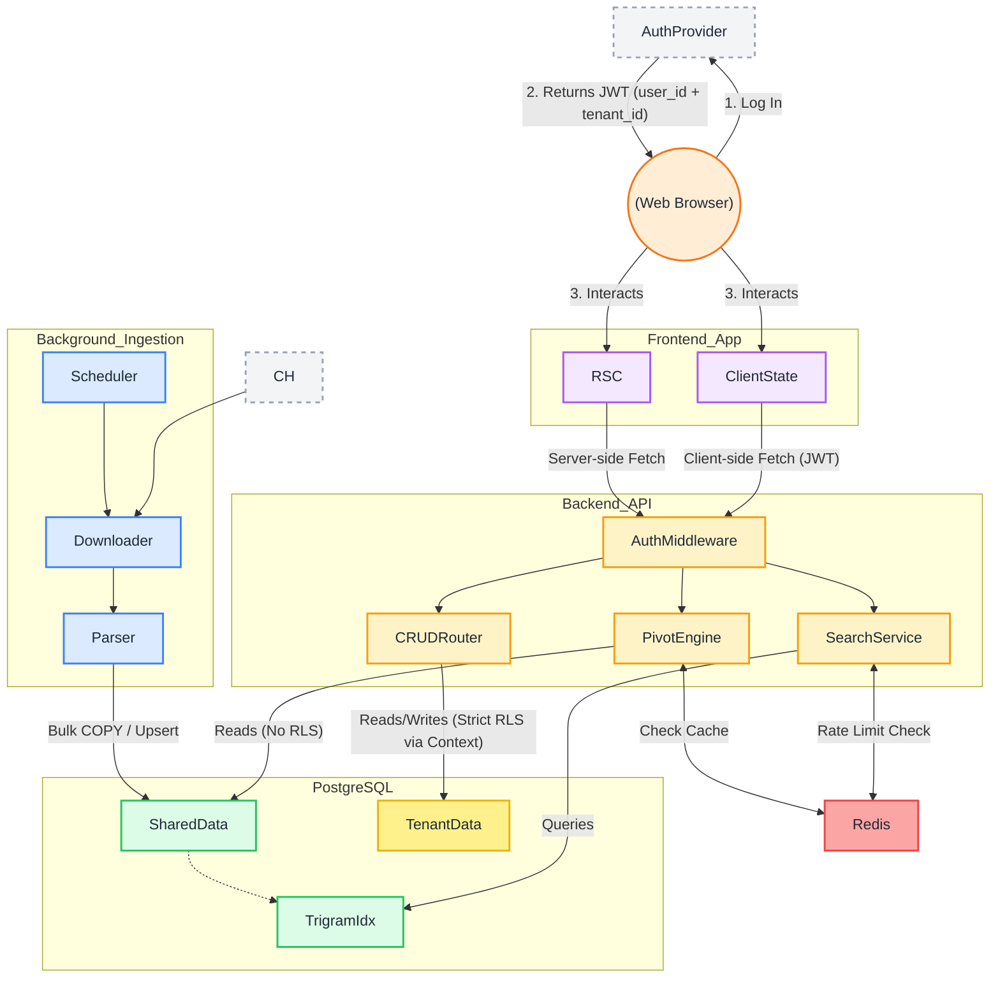

```mermaid
graph TD
    %% Styling
    classDef external fill:#f3f4f6,stroke:#9ca3af,stroke-width:2px,color:#1f2937,stroke-dasharray: 5 5;
    classDef worker fill:#dbeafe,stroke:#3b82f6,stroke-width:2px,color:#1f2937;
    classDef dbShared fill:#dcfce7,stroke:#22c55e,stroke-width:2px,color:#1f2937;
    classDef dbTenant fill:#fef08a,stroke:#eab308,stroke-width:2px,color:#1f2937;
    classDef cache fill:#fca5a5,stroke:#ef4444,stroke-width:2px,color:#1f2937;
    classDef api fill:#fef3c7,stroke:#f59e0b,stroke-width:2px,color:#1f2937;
    classDef web fill:#f3e8ff,stroke:#a855f7,stroke-width:2px,color:#1f2937;
    classDef user fill:#ffedd5,stroke:#f97316,stroke-width:2px,color:#1f2937;

    %% External Systems
    CH:::external
    AuthProvider:::external

    %% Background Ingestion (C++)
    subgraph Background_Ingestion
        Scheduler:::worker
        Downloader:::worker
        Parser:::worker
        Scheduler --> Downloader --> Parser
    end

    %% Database (PostgreSQL)
    subgraph PostgreSQL
        SharedData:::dbShared
        TenantData:::dbTenant
        TrigramIdx:::dbShared
    end

    %% Caching Layer
    Redis:::cache

    %% Backend API (Node.js/FastAPI)
    subgraph Backend_API
        AuthMiddleware:::api
        SearchService:::api
        PivotEngine:::api
        CRUDRouter:::api
    end

    %% Frontend (Next.js)
    subgraph Frontend_App
        RSC:::web
        ClientState:::web
    end

    %% End User
    Client(("(Web Browser)")):::user

    %% Connections & Flow
    %% Ingestion Flow
    CH --> Downloader
    Parser -- "Bulk COPY / Upsert" --> SharedData
    SharedData -.-> TrigramIdx

    %% User Auth Flow
    Client -- "1. Log In" --> AuthProvider
    AuthProvider -- "2. Returns JWT (user_id + tenant_id)" --> Client

    %% Request Flow
    Client -- "3. Interacts" --> RSC
    Client -- "3. Interacts" --> ClientState
    RSC -- "Server-side Fetch" --> AuthMiddleware
    ClientState -- "Client-side Fetch (JWT)" --> AuthMiddleware

    %% Backend Flow
    AuthMiddleware --> PivotEngine
    AuthMiddleware --> SearchService
    AuthMiddleware --> CRUDRouter

    %% Cache interactions
    PivotEngine <-->|"Check Cache"| Redis
    SearchService <-->|"Rate Limit Check"| Redis

    %% DB Interactions
    SearchService -- "Queries" --> TrigramIdx
    PivotEngine -- "Reads (No RLS)" --> SharedData
    CRUDRouter -- "Reads/Writes (Strict RLS via Context)" --> TenantData
```


## Backend ##

```
# Install FastAPI, Uvicorn (the server), and Asyncpg (ultra-fast Postgres driver)
```